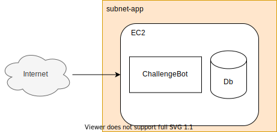
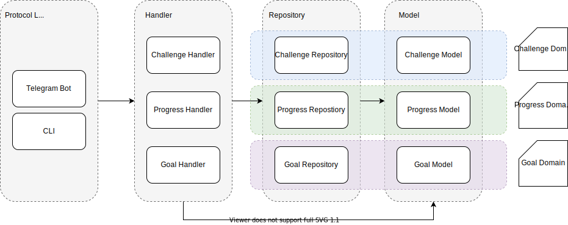

# Overview
challenge-bot is an idea to gamify and motivate individuals to achieve their goals. The bot will reside in telegram as the mode of interacting with users. There is a need to provide a backend service for the bot client to provide rich interactions and persistence of data.

# Terminology
Challenge: Consists of progress and goals. Has a deadline and finishes when the goal is hit.
Progress: Data value attached to a challenge by a user.
Goals: Data value to determine if challenge has been finished.
User: A unique ID that is joins challenges, adds progress and goals.

# Non Goal
1. No distributed instances; that is to say there will be only one instance that the bot will reside in due to API token limitation of telegram.
2. No guarantee of high performance or SLA due to the nature of costing and involvement in this project.
3. There isn't any requirement for resillience.
4. Redundancies from an infra level will not be the focus of this project

# Design
## Architecture
This section provides the high level architecture of challenge-bot. There are two types of architecture level: Infrastructure, Code Base and Persistence.

### Infrastructure
challenge-bot will be deployed on AWS. It currently however does not include the use of managed solution like RDS or ElasticCache. As of now it will be deployed in an EC2 instance as a monolith.



### Code Base
The code base in challenge-bot will be split into several components: Protocol, Handler, Repository and Domain.
The code base tries to abide by Domain Driven Development (DDD) when it is appropriate.



### Package Design
Packages will be created with bounded context in mind. This means that the parent package will be in the form of: Challenge, Progress, Goal. Only code that is related to the specific domain will be added within the “parent” package. The coupling of the different domain will be done in the Handler layer.

```
internal/
|__challenge/
     |__ model/
     |__ repository/
|__ progress/
|__ goal/
|__ handler/
|__ protocol
     |__ bot/
     |__ cli/
|__ storage/
     |__ postgres/
     |__ localcache/
```

## Persistence
Telegram bot API does not provide a way to keep track of sessions or states. It is therefore left to the backend to handle persistence.
In memory local cache will be used to store a users requests and state that they are currently in
This local cache will only be used for the bot client.
The cache will be used to store a session for the bot to show the interaction buttons.

### Cache Key
Cache will be generated as such:

Keep track of current user’s state + data

```
"<user_id>_state": {
  "state": “ADD_PROGRESS_DATA”,
  "challengeID": 1,
  // ... other required data
}
```

Keys will have an expiry of one hour.
The eviction policy will be LFU.

### States
This section lists down the states and their respective transitions as users interact with the system. These states are obtained from the localcache using the cache key above.

#### Main Entry Point
MAIN_INIT or no cache key

#### Join Challenge
JOIN_CHALLENGE_AVAILABLE
JOIN_CHALLENGE_GOAL

#### View Challenge
VIEW_CHALLENGE_JOINED
VIEW_CHALLENGE_OPTIONS

ADD_PROGRESS
ADD_PROGRESS_DATE
ADD_PROGRESS_DATE_INPUT

UPSERT_GOAL

#### Create Challenge
CREATE_CHALLENGE_NAME
CREATE_CHALLENGE_DETAIL
CREATE_CHALLENGE_DATE
CREATE_CHALLENGE_GOAL
